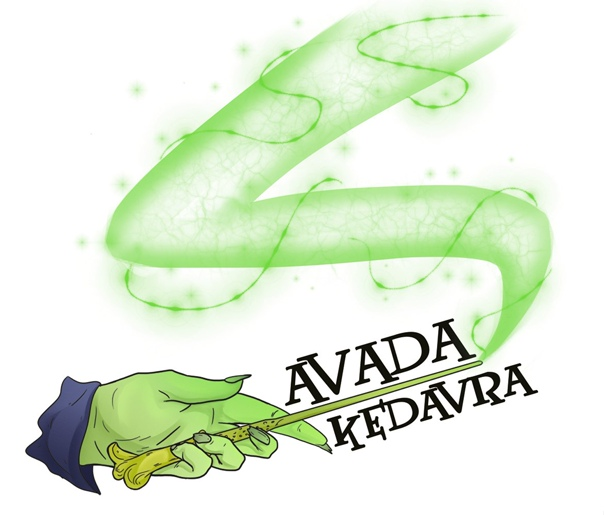

# Инструкция по работе с Git

Начальная работа с системой контроля версий.

*git --version* - это команда для проверки версии git

*git init* - инициализация пустого репозитория

*git status* - проверка тегущего состояния файла

*git add* - добавление версионности файлу

*git commit -m "Сообщение"* - команда для фиксации изменений файлов

*git log*  - вывод истории комитов в хронологическом порядке

*git diff* - вывод изменений на текущий комент по отношению к последнему комиту

Чтобы веделить ненумированный, список используйте (*) или +: 

+ один

Чтобы добавить ненумированные списки необходимо пункты выделить (*). Например, вот так: 

* Элемент 1

* Элемент 2

Чтобы добавить нумерованные списки необходимо пункты просто пронумеровать. Например, вот так:

1. Пункт

2. Пункт

### _Не волнуйтесь, если что-то не работает. Если бы всё работало, вас бы уволили._

             Mosher’s Law of Software Engineering

Чтобы добавить изображение в текст достаточно добавить следующее: 
## Добавление разметки Markdown
Абзацы создаются при помощи строки. Если вокруг
текста есть пустые строки, то текст
превращается в абзац.

# Ссылки

Это встроенная [ссылка с title элементом]
(http://example.com/link "Я ссылка"). Это — [без title]
(http://example.com/link).
А вот [пример][1] [нескольких][2] [ссылок][id] с
разметкой как у сносок. Прокатит и [короткая запись][]
без указания id.

> Donec sit amet nisl. Aliquam semper ipsum sit amet
velit. Suspendisse
id sem consectetuer libero luctus adipiscing.

 ### Зачеркивание

В **GFM** добавлено зачеркивание текста: две тильды `~` до и после текста. Например, вот так: ~~Убивающее заклятие (Авада Кедавра)~~

Чтобы добавить изображение в текст достаточно добавить следующее: 

 ### Таблицы

В чистом **MarkDown** нет синтаксиса для таблиц, а в **GFM** есть.

First Header | Second Header
------------- | -------------
Content Cell | Content Cell
Content Cell | Content Cell

Для красоты можно и по бокам линии нарисовать:

 First Header | Second Header |
| ------------- | ------------- |
| Content Cell | Content Cell |
| Content Cell | Content Cell |

*Можно управлять выравниванием столбцов при помощи двоеточия.*

Внутри таблиц можно использовать ссылки, наклонный, жирный или зачеркнутый текст. **Для всего остального есть обычный HTML.**

> Первый уровень цитирования
>> Второй уровень цитирования
>>> Третий уровень цитирования
>
>Первый уровень цитирования

* __Тезис №1__
* __Тезис №1__
Раскрываем тезис.

* __Тезис №2__
Раскрываем тезис.

**Чтобы поставить гиперссылку без анкора, нужно взять URL в угловые скобки. С e-mail –
аналогично.**

**Чтобы поставить гиперссылку, нужно взять URL в угловые скобки. С почтой –
аналогично.**

# ИНСТРУКЦИЯ ДЛЯ РАБОТЫ С GITHUB

✦	git init – инициализация локального репозитория

✦	git status – получить информацию от git о его текущем состоянии

✦	git add – добавить файл или файлы к следующему коммиту

✦	git commit -m “message” – создание коммита.

✦	git log – вывод на экран истории всех коммитов с их хеш-кодами

✦	git clone <url-адрес репозитория> – клонирование внешнего репозитория на  локальный ПК

✦	git pull – получение изменений и слияние с локальной версией

✦	git push – отправляет локальную версию репозитория на внешний

✦	git remote set-url origin <url-адрес репозитория> – сбрасывает линк с предыдущего репозитория. 

**Необходимо при перепривязке нового адреса на локальном репозитории.**

*ПРИМЕЧАНИЕ*

Для бесплатных учетных записей сайт GitHub предоставляет всю функциональность, но ваши проекты будут полностью открытыми (у любого пользователя будет доступ на чтение). 

Платные учетные записи в GitHub дают возможность создавать различные варианты закрытых проектов, но их рассмотрение выходит за рамки темы данной книги.

## Ветвления проектов

_Для участия в чужом проекте, где у вас нет права на запись, нужно **создать ветку (fork)** этого проекта. То есть **GitHub** генерирует отдельную копию проекта,
находящуюся в вашем пространстве имен, и предоставляет вам доступ на запись
туда._

